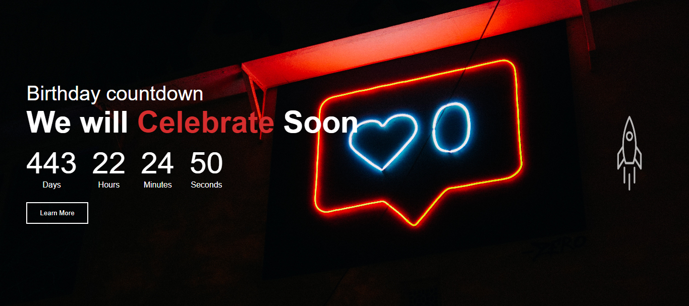

### By Akshun Verma

## Project Name: CountDown

- In this project I have made CountDown, which will tell us the total remaining days, hours, minutes and seconds to a particular day. I have made this with HTML, CSS and JavaScript. It is also responsive.

### ✍️ Author and 📞 Contact
- Akshun Verma
   - 
   - 

#### Honest time to finish the project !
 - I had taken around 2 hours to finish this project.

### Link of the website
- [Please Click Here](https://countdown-app-aivy3945.netlify.app/)

- 

 ### Feedback
 - If you have any feedback, please reach out to me at akshunverma45@gmail.com
